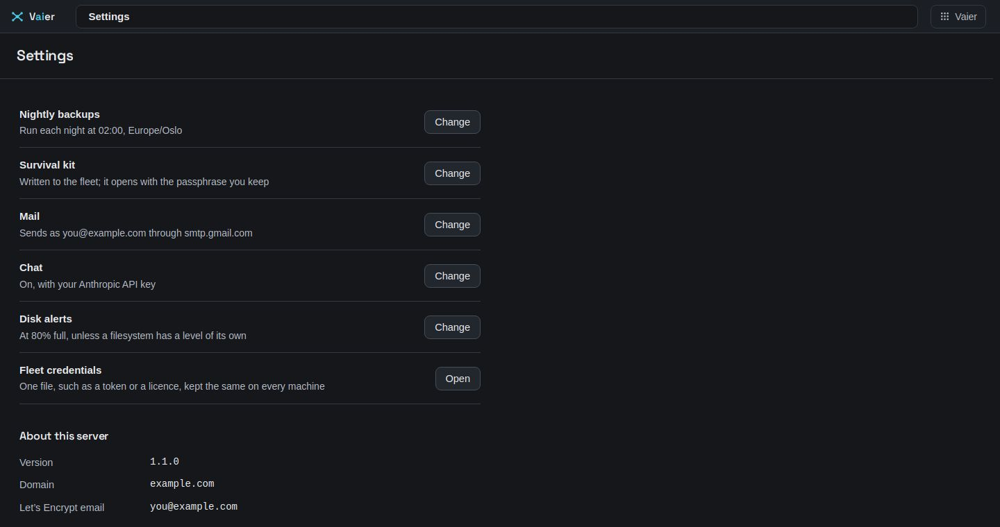

# Advanced topics

Back to [README](../README.md).

Configuration and workflows beyond the basic Quick Start. If you're just getting started, the README is enough.



---

## The installer

`install.sh` installs Vaier and updates it by hand. It always fetches the runtime files for one ref of the repository (pin it with `VAIER_REF`: a branch, tag or commit), creates `.env` at mode `600` if there is none, and adds any auto-generated secret `.env` lacks. It never changes a value you set.

**At a terminal, it finishes the job** — including `curl … | bash`:

- **Asks three questions on a fresh install**: your **domain**, your **email** (Let's Encrypt's contact and the first-run sign-in account — see [AUTH](AUTH.md#the-first-run-password-before-you-have-registered-anything)), and your **time zone** for schedules. They go into `.env` as `VAIER_DOMAIN`, `ACME_EMAIL` and `VAIER_TZ`.
- **Checks DNS.** If `vaier.<domain>` doesn't point here yet, it prints the exact wildcard record to make. Starting now is fine — Vaier waits for the record before asking for certificates ([Wildcard DNS](NETWORKING.md#wildcard-dns)).
- **Offers to install Docker** when it is missing.
- **Offers to start Vaier** and prints the first-run sign-in: URL, email and password.

Sign-in providers and mail are set later in the console — Google or GitHub under **People → Sign-in providers** ([AUTH](AUTH.md#registering-google-or-github)), mail under **Settings**.

**Re-run on an existing install**, it asks nothing and offers **Bring Vaier up to date now?**

**Without a terminal** (or with `VAIER_NONINTERACTIVE=1`) it only does the groundwork and prints the next steps. **Settings → Update Vaier** runs it this way ([Monitoring](MONITORING.md#updating-vaier-itself)).

**Docker Compose v2.23 or newer** is required. The installer's own Docker install is always new enough.

**`required variable … is missing a value`** from `docker compose up -d` means your `.env` predates a secret a newer release generates. Re-run the installer to add it; a running stack keeps running meanwhile.

---

## Removing Vaier

`uninstall.sh` removes the stack's containers, networks and images, the routes Vaier added on the host, the install folder, and Vaier's files in your home folder (plus the backup client's sudoers rule and the SSH keys Vaier made, if present). It finds the stack through Docker's own labels, so it works after the folder is gone. It asks before removing anything; `VAIER_UNINSTALL_DRY_RUN=1` only prints what it would do. Docker itself, your DNS record and firewall rules are left to you.

---

## Environment variables

| Variable | Required | Description |
|----------|----------|-------------|
| `VAIER_DOMAIN` | Yes | Base domain (e.g. `yourdomain.com`) |
| `ACME_EMAIL` | Yes | Let's Encrypt email; first-run account if `VAIER_ADMIN_EMAIL` is blank |
| `VAIER_TZ` | No | Time zone for schedules, e.g. `Europe/Oslo` (default `UTC`) |
| `VAIER_OIDC_GOOGLE_CLIENT_ID` | Optional | Google OAuth client id |
| `VAIER_OIDC_GOOGLE_CLIENT_SECRET` | Optional | Google OAuth client secret |
| `VAIER_OIDC_GITHUB_CLIENT_ID` | Optional | GitHub OAuth App client id |
| `VAIER_OIDC_GITHUB_CLIENT_SECRET` | Optional | GitHub OAuth App client secret |
| `VAIER_ADMIN_EMAIL` | No | First admin; restored to admin whenever none remains |
| `VAIER_OAUTH2_COOKIE_SECRET` | Auto | oauth2-proxy session cookie secret |
| `VAIER_DEX_CLIENT_SECRET` | Auto | oauth2-proxy↔Dex shared secret |
| `VAIER_CROWDSEC_BOUNCER_KEY` | Auto | CrowdSec bouncer API key |
| `VAIER_PUBLIC_HOST` | No | Public hostname, when not on EC2 |
| `VAIER_PUBLIC_IP` | No | Public IPv4, when not on EC2; what `*.<domain>` should resolve to |
| `VAIER_SERVER_LAN_CIDR` | No | The server's own LAN, for LAN servers with no relay peer (see below) |
| `WIREGUARD_CONFIG_PATH` | No | WireGuard config dir (default: `/wireguard/config`) |
| `WIREGUARD_CONTAINER_NAME` | No | WireGuard container name (default: `wireguard`) |
| `TRAEFIK_CONFIG_PATH` | No | Traefik dynamic config dir (default: `/traefik/config`) |
| `TRAEFIK_API_URL` | No | Traefik API URL (default: `http://traefik:8080`) |

"Auto" secrets are generated into `.env` for you. A provider is offered only when both its client id and secret are set; its redirect URI is `https://dex.<domain>/callback`. With no provider, Vaier opens the [first-run door](AUTH.md#the-first-run-password-before-you-have-registered-anything) instead.

On EC2 the public address and subnet are read from instance metadata. Elsewhere, set `VAIER_PUBLIC_HOST` or `VAIER_PUBLIC_IP` — without one, Vaier can check that `*.<domain>` resolves, but not that it resolves *here*.

---

## Secrets on disk

Vaier writes new secret files at mode `600`. On an older deployment, tighten existing files too:

```bash
chmod 600 .env
chmod -R go-rwx vaier/ oauth2/ wireguard/ traefik/
```

| File | Contents |
|------|----------|
| `vaier/config/vaier-config.yml` | Domain, SMTP settings **and the SMTP password** — owner-only |
| `vaier/config/access.yml` | Access store — the known identities, their roles and access groups |
| `oauth2/config/client-secret` | Google OAuth client secret |

Keep `.env` at mode `600`.

---

## Publishing a service from a LAN server (Docker optional)

A *LAN server* is any machine that isn't itself a VPN peer — a NAS, a printer, IPMI, an extra Docker host — on a relay peer's LAN or **in the Vaier server's own subnet** (an AWS VPC, say). Register it once, then publish its services.

1. Make sure its address is covered by something Vaier routes to:
   - **Behind a relay peer:** Vaier offers the peer's network on that machine's page — "Colina 27 sits on 192.168.1.0/24" — usually one click. For a network it can't see, set it under **Advanced → Network behind it** in the machine's edit form.
   - **In the Vaier server's own subnet:** on EC2 the subnet is auto-detected. To cover the whole VPC (e.g. `172.31.0.0/16`), or off EC2, set `VAIER_SERVER_LAN_CIDR`. Allow inbound from the Vaier server in the machine's security group or firewall.
2. (Docker only) Expose the LAN server's Docker socket on TCP 2375, firewalled to the LAN/VPC range (no TLS). The Add Machine modal shows the one-liner: `curl https://vaier.<domain>/lan-servers/docker-setup.sh | sudo bash -s -- --port 2375`.
3. In Vaier → Machines, click **+**, pick **LAN server**, enter a name and the LAN address, and toggle Docker on or off.
4. With Docker on, its containers appear in the discovered list and can be published. For a native service, use Services → **+ Publish LAN service**: pick the machine, enter port, subdomain and protocol. No DNS step.

> **Limitation:** the "Vaier server's own subnet" path doesn't yet let *split-tunnel server peers* reach that subnet. Full-tunnel mobile and Windows clients already can.
