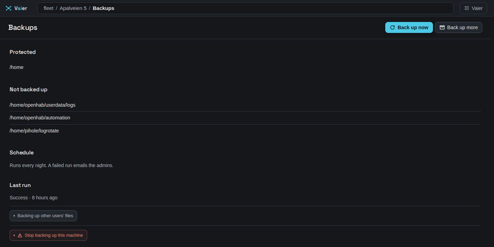

# Fleet backup

Back to [README](../README.md).

**Tick what matters. Vaier does the rest.** That is the only path you need to learn. Everything after the first section is reference, for adopting existing borg setups or recovering by hand.

## Tick what matters

Open a machine's files in the **Explorer**, tick the folders you would want back if the machine died, and press **Back up**. That is your one decision. Vaier does the rest:

- creates a repository for the machine on the backup server, with a generated passphrase;
- prepares the machine on its first backup (trusts its key, installs the client);
- runs every night;
- emails the admins only when a run fails or came back with holes.

**Back up more** takes you back to the files. **Stop backing up** removes a path; when the last one goes, the machine's job goes too. Archives already made are kept.

The archives are [borg](https://www.borgbackup.org/) repositories on the fleet's **backup server**, one per machine. The passphrases live in Vaier and in the **survival kit**.

---

## Backup server

The fleet has **at most one**. On a machine's Inspector in the **Explorer**, use **Make this the fleet's backup server** (offered only while none is designated). Vaier looks first and says what it will do in one sentence: use the borg server it found there, or set up a **pinned** borg-server container on the local disk with the most room. Press **Use it** or **Set it up**. **Change details** opens the coordinates form, and it opens on its own when Vaier cannot see the machine's containers or disks.

The server's `backup` entry has **Server details** and, under the fold *Provision, authorize or remove this backup server*: **Provision**, **Authorize a host**, **Setup script**, **Edit coordinates**, **Remove designation**.

- Where Vaier can't drive docker over SSH (a Synology NAS, say), it stages **setup.sh** on the host and hands you one command: `sudo bash <path>`. If it can't reach the host, download setup.sh from the UI.
- If the backup server goes quiet, Vaier emails every admin, and again when it recovers.

**Authorize a host** trusts a machine's SSH key on the server. The key is confined to that machine's own repositories, so one compromised machine can't touch another's archives. It also pins the server's host key on the machine.

**Adding a repository for a machine means re-authorizing that host**; until then, backups to it are refused.

---

## Backup repository

You never create one by hand: **Back up** makes one per machine. Each is an entry under the backup server's `backup` entry, showing its path, append-only setting, stored passphrase and archives, with **Edit** and **Delete**. Delete forgets it in Vaier; it does not erase the archives.

- A name may hold only letters, digits, `_` and `-`; "NUC 02" becomes `NUC-02`.
- A new repository's passphrase is shown once with a copy button. Save it — it is never shown again.
- A repository's passphrase can't be changed afterwards; **Edit** covers its path and append-only setting.

**Prepare client** installs borg and grants the SSH user **passwordless sudo for the borg binary alone**, which **as root** jobs need.

---

## Backup jobs

Each machine has one job: repository, source paths, excludes, retention (`keepDaily` / `keepWeekly` / `keepMonthly`), compression (default `zstd,6`), enabled, and **as root**. It lives on the machine's `backup` entry in the **Explorer**. **Tick what matters** maintains it for you.

### Back up as root

borg runs as the SSH user, so **files that user cannot read are skipped**. Container volumes are the usual victims.

**You are asked only when it has cost you something.** Such a run settles **incomplete**, emails the admins, and **Needs you** shows *‹machine›'s last backup is missing N files*, with **Back up everything**. One click installs the grant and turns the setting on. Where Vaier can't gain root, it hands you a `sudo bash <path>` command.

To turn it back **off**, untick *Back up files owned by other users* under **Advanced** on the `backup` entry.

**A passwordless `sudo borg` is root-equivalent.** Turning it on makes Vaier's SSH credential for that machine as powerful as root. Grant it only where that is acceptable.

### Running

Press **Run now** on the machine's `backup` entry, or let the **nightly schedule** run every enabled job. Set its hour (default 2) in **Settings**. A machine runs one backup at a time.

Each **backup run** ends as success, warnings, **incomplete**, failed, or unknown.

- **Incomplete** — some source files couldn't be read. The archive has holes, so this counts as a **failure**: red in the Explorer and a *Backup incomplete* mail naming the lost files.
- **Warnings** — borg grumbled but lost nothing (a file changed while read). Not a failure; no mail.
- **Failed** — including a run that never started (no SSH access, no credential, no borg). Emails every admin once, and again when the job recovers.

A run that didn't end cleanly shows its **run diagnostics**: the lines borg reported, such as `Permission denied`.

Each machine keeps its borg passphrase file in `~/.vaier-backup`. Starting a run closes any archive you had open on that machine, since borg needs the repository to itself.

A machine [switched off on purpose](EXPLORER.md#switched-off-on-purpose) is **skipped, not failed**: no run, no red mark, no mail.

### Archives

Open a **backup repository** entry to list its archives. **Restore from the UI is not yet available** — use the borg CLI, or copy files out of an archive with the Explorer's time rail (see [`docs/EXPLORER.md`](EXPLORER.md)).

---

## Survival kit

Your repository passphrases live inside Vaier, and Vaier's own backup is encrypted with one of them. Lose the Vaier server and nothing left can open your archives.

The **survival kit** fixes that: every repository's address and passphrase, the borg commands to read them, and Vaier's **config key**, encrypted under **one passphrase you choose**. Set it in **Settings → Survival kit** and press **Write the kit now**.

- **Vaier picks the hosts and says why**: reachable servers, never itself, spread across sites. It tells you whether anything written now outlives this server.
- Each copy is `vaier-survival-kit.txt` (`0600`) in the SSH user's home.
- **Opening it needs no Vaier**: the `openssl enc -aes-256-cbc -pbkdf2 -d` command is printed at the top of every copy, with its date.
- **Vaier keeps them current itself**: a new repository, passphrase, job or machine name rewrites every copy, as does changing the kit passphrase.
