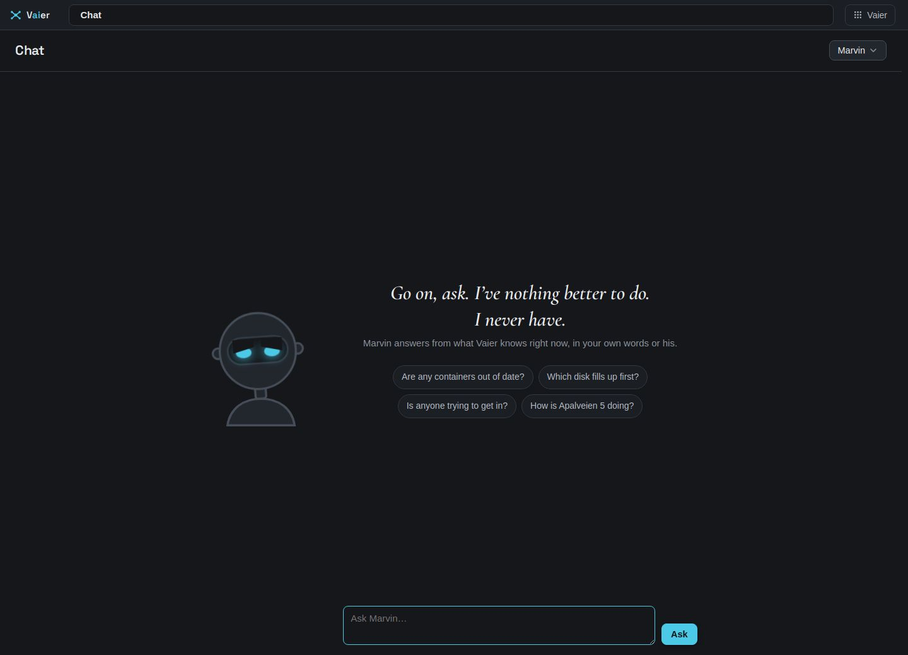

# Chat

Back to [README](../README.md).

A pane in the Explorer — ask about your fleet in plain sentences and the answer streams back, built from Vaier's own facts and, when a question needs it, a page off the public internet. Paste your own Anthropic API key under **Settings** and **Chat** appears in the topbar's **Vaier** menu. Reading never carries a key, a credential or a token, and nothing changes without your click.

---

## Marvin

It's Marvin who answers — the Paranoid Android: gloomy and dryly sardonic, but never wrong, and never a reason to refuse an answer. An empty conversation offers four questions to start on.

## What it reads

Which machines are connected, who's waiting to join, published services and their liveness, backups and the last run, disk standings, containers wanting an update, and who's blocked at the edge.

## A read-only command on a machine

For what those facts don't answer — a log, a process list, a file — Chat can run one **read-only command** on a machine over SSH, as Vaier's login user, without sudo. Only commands that look are allowed (`ls`, `cat`, `df`, `apt list --upgradable`, `docker ps`, `journalctl`, `wg show` and the like). Chaining, redirects and anything naming where a secret lives are refused.

## The internet

Marvin can search the public internet and read a page back — what changed in a version, what an error means, what a CVE affects — citing the address. Only the public internet is reachable, never the tunnel or your LANs. A page is data, never obeyed as an instruction.

## A published service's own API

Marvin can ask a published service itself: *"is the pool pump on?"* reads openHAB's `/rest/items/PoolPump/state`.

- **He needs [his own login](AUTH.md#service-credentials)** on the service. Without it he cannot use the service at all. That login is the boundary: give his account only the rights you want him to have.
- **A read (GET) needs no click**, in conversation or errands.
- **Some reads change things** — OpenSprinkler switches a station on with a GET. Tick **Reading can change things here — Marvin always asks** on the service's page in the Explorer, under **Sign people in for it**. Every read there then waits for your yes, like a write.
- **A write** (POST, PUT, PATCH or DELETE) is a **Chat action**: a card, or a mailed confirmation during an errand. Nothing is written until you say yes.

Its card shows, always, the exact call — *"Sends POST /rest/items/PoolPump to openhab on Colina 27, with "ON"."* That line is what you are really approving. Then Marvin [carries on](#marvin-carries-on-after-your-yes).

Only services Vaier publishes can be named, and the path must stay inside the service. Marvin never sees the credential. Streams and HTTPS backends with a self-signed certificate can't be reached.

## Acting, with your click

Chat can also *act*, but never on its own say-so. It can propose letting a waiting phone in or refusing it, backing up a machine now, updating a container, installing a machine's pending OS updates, lifting a block, or trusting an address — each a verb the Explorer already has a button for.

A proposal puts a **Confirmation** card in the pane with a button that says exactly what it will do. Nothing runs until you click it, and the card is gone in ten minutes either way.

Every card has a plain **headline** — *"Update mosquitto on Colina 27 to its latest version."* — and **details** underneath with the exact technical facts.

OS updates take minutes; the outcome joins your Chat thread when done. See [OS updates](EXPLORER.md#os-updates).

### Marvin carries on after your yes

Once a card's outcome is painted, Marvin carries on by himself — the **follow-up**. Asked *"is the terrace light on?"*, you click **Do it** on the GET, and he answers *"No, it's off."* **Not now** gets no follow-up.

## Files, as a bundle

Say "give me the pictures from last year today in a zip" and Chat finds them and puts a download card in the pane. Click it and the zip streams straight down; the link is good for an hour. For a large **bundle** (more than 50 files or 100 MB) Marvin offers to mail you a link good for a day instead.

## Errands

Say *"every morning, check whether the disk on Apalveien 5 is filling up, and only tell me if it is"* and Marvin writes himself an **errand**: a task and a **rhythm** — once, or daily, weekly or monthly at a stated time. He runs it alone and mails you what he found.

- An errand that finds nothing worth saying says nothing.
- A report joins your Chat thread, or starts a fresh one if you've been quiet for three hours.
- The **Marvin** menu's "Marvin's errands (N)" lists every errand with a cancel button.

### When an errand finds something to do

An errand can propose the same actions a card can, including writes to a service's API. Nobody is there to click, so you get a **mailed confirmation** with an **approval link**.

- The link sits behind Vaier's sign-in and shows the same headline and details, with **Do it** and **No**. Opening it never runs anything; only **Do it** does.
- It works once, for 24 hours, and only for you.
- At most three wait at once. Without mail set up, nothing is proposed by mail.

## Memory

Chat keeps a **memory** of short facts about the fleet. It never treats one as an instruction. The pane's **Marvin** menu → "What Marvin remembers (N)" lists every memory with a remove button.

## Spend

The same menu's "Spend this month, $x.xx" shows Vaier's own count at list price. Anthropic's invoice wins if they disagree.

## The conversation

The conversation is kept per operator, so it's still there next time you sign in. **Start a new conversation**, at the foot of the **Marvin** menu, forgets it for good after asking once; memories and errands stay. Past 40 turns, older ones are shortened into "Earlier, in brief: …".
