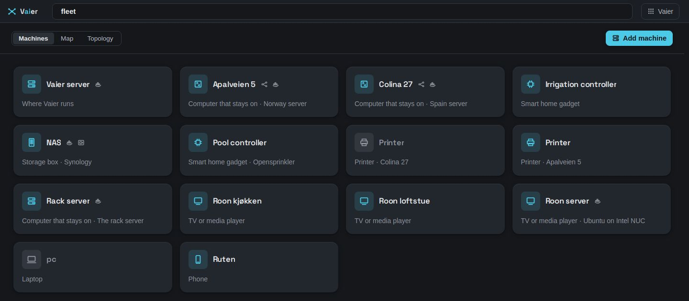
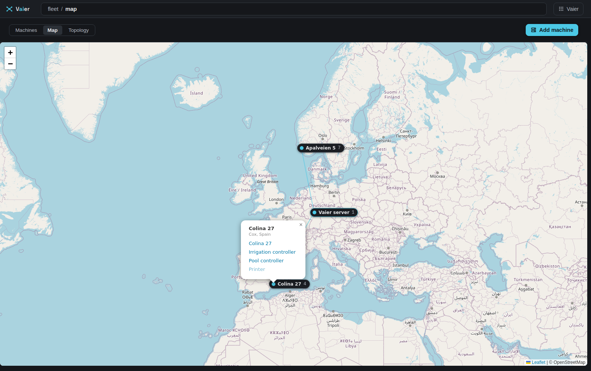

# Explorer

Back to [README](../README.md).

The Explorer, at `/explorer.html`, is one address space for the whole fleet. Every entry has its own link, and the address bar says where you are.

---

## The front door and the menu

Your Vaier's address takes an admin to the **Fleet** and everyone else to **Your services**, the page of tiles (still at `/launchpad.html`). The Vaier logo always leads back there.

- Your avatar, at the topbar's right end, holds **Sign out**.
- The **Vaier menu** holds **Your services**, **People**, **Security**, **Chat** (while an Anthropic key is stored), **Settings** and, at its foot, **Concepts**, the in-app glossary.
- **Settings** holds what you set up once: backup hour, survival kit, mail, Chat's key, default disk alert level and **Fleet credentials**. Each is one line with **Change**. Trouble is never shown here; it goes in **Needs you**.

---

## Needs you

The top of the **Fleet** answers "is anything wrong?". **Needs you** is one list: a plain sentence per problem, its evidence, and at most one button to the fix. Most urgent first:

- someone waiting to join (**Add**);
- what the [pre-flight](MONITORING.md#pre-flight) found wrong;
- an alert mail that did not go out (**Check mail**);
- a Vaier update that failed or rolled back;
- a server not answering (**I switched it off**, see below) — phones and laptops that are away are never listed;
- a backup that went wrong (**Open its backup**, **Get this machine ready**, or **Back up everything**);
- a disk past or near its threshold (**Open its disk**);
- security updates waiting (**Install OS updates**);
- [reverse proxy config](MONITORING.md#reverse-proxy-audit) entries no route can reach (**See which**);
- up to three suggestions of what to do next;
- a newer Vaier (**Update Vaier**), and newer container images (**See them**).

A row goes the moment its problem clears. **When nothing needs you, the list shows nothing and takes no room.**

Machines are **sorted trouble-first**, and a card wears a short mark for its trouble ("Backup failed"). A machine's own page opens on its own Needs you rows.

### Switched off on purpose

Some machines are off because you turned them off. Tap **I switched it off** on its "not answering" row and Vaier stops treating that as trouble: its card turns grey, nothing is mailed, and its nightly backup is skipped, not failed.

Its page says "Switched off on purpose since 14 Sep", with **It's back on**. You rarely need that button: the mark clears itself the first time Vaier reaches the machine again. Phones, laptops and the Vaier server are never offered it.

---

## The address space

A machine's page shows its name (plus one line when it is not well), its Needs you rows, and then its **doors**. A machine only gets the doors Vaier can actually reach:

| Door | Entry | Its fact |
|------|-------|----------|
| **Shell** | — (opens a window) | "Opens where you left off" |
| **Files** | `files` | "Browse its files" |
| **Apps** | `containers` | "8 apps · 1 update" |
| **Websites** | `services` | "7 websites · 1 ready to publish" |
| **Storage** | `disk` | "60% full" |
| **Backups** | `backup` | "Backed up last night", "Paused — switched off" |

A door is greyed, with the reason on hover, when Vaier can't sign in. Below the doors come **What to do next** (nudges for this machine) and, when updates wait, a line such as "4 updates waiting · none urgent" with **Install OS updates**.

Everything else sits in one closed fold, **Sign-in, details and removal**: who Vaier signs in as (**Change**, **Stop Vaier signing in here**), addresses, **Edit details**, **Send its setup again**, **Give it new keys**, and **Remove machine** last, in red.

**Every location has its own link**, including the archive you're viewing, so reload, Back and bookmarks all work.

### One pane, at every width

There is no tree column. Drill in through cards and listings; come back through the address bar's crumbs. The Fleet's head carries one switch, **Machines · Map · Topology**, and **Add machine**.

A healthy **machine card** says almost nothing: what the machine is and your description of it ("Storage box · Synology"), and small glyphs for relay, Docker or backup server. **Marks** appear only for trouble — a failed backup, a filling disk, **Claude signed out**, containers wanting a newer image. A machine that is down reddens its whole card.

A machine Vaier hasn't read yet shows no disk mark. That is not a claim the disk has room.

People, Security, Chat and Settings live in the **Vaier menu**, not in the fleet. See [Access management](AUTH.md#access-management) for People.

### Files

Folders are read over SFTP as you open them, using the machine's stored credential. A folder that can't be read shows the server's own message, never an empty listing. A machine whose SSH has no SFTP (DietPi's Dropbear) needs `openssh-sftp-server` or OpenSSH. Paths are always the machine's own, even on a NAS that jails SFTP into `/volume1`.

### Containers and published services

**Apps** lists containers with a published port, running or stopped. A stopped one reads **DOWN**; one Vaier saw running and now finds stopped reads **gone**.

Vaier cannot start, stop or read logs — use the shell. Its one action is **Update** on an out-of-date container started by compose: it pulls the new image, recreates the container and removes the old image. A container on a **moving tag** (a daily `latest`) is marked `moving` and never mailed about.

**Websites** lists published services. A route in trouble reads **Not answering**. Unpublished containers appear under **Ready to publish**, and **Publish a service by hand** covers anything else. Opening a service gives **Open** and four blocks: **Who can open it**, **Sign people in for it**, **In Your services**, and folded **Details**. **Unpublish this service** comes last and leaves the container running. See [NETWORKING](NETWORKING.md).

### Disk

**Storage** lists every real filesystem with its usage and threshold. Mute one that is full by design, or give it its own threshold. A new volume is watched by default. See [MONITORING](MONITORING.md).

### The backup server's own entry

Pick the fleet's backup server with **Make this the fleet's backup server** on a machine's page. It then shows **Backups kept here**, one per machine; Vaier creates them, you never do. **Forget these backups** forgets them in Vaier without erasing any archive. The manual tools (**Provision**, **Authorize a host**, …) sit under a warning fold: they are for recovery. See [BACKUP](BACKUP.md).

### Selection, transfers and viewing files

**Tick files to build a Selection**; it survives moving between folders and machines. The bar above the listing carries every verb that applies.

- **View** images, PDFs, text and video in a new tab. HTML and SVG are download-only.
- **Download** a file, or a zip of a folder or several items.
- **Transfer** a file or folder to another machine, with live progress.
- **Upload** by dropping files on the folder or with **Upload files**. Files only. An existing name is never replaced without asking.
- **Delete** behind a typed machine-name confirmation. It cannot be undone.

**Every write goes to the present.** Copying *from* an archive and pasting back is how you restore. Verbs Vaier's sign-in can't perform are hidden; an ACL or read-only mount can still make the machine refuse.

### Browsing the past (the time rail)

A machine with backups grows a **time rail**: one stop per archive, newest nearest **Now**. Click a stop to see the files as they were. The past turns amber and offers no write verbs. Click **Now** to return. While that machine's backup is running, borg locks the repository and the past shows its error instead; try again when the run ends.

### Marking what matters (backing up from the file view)

**Mark what matters and Vaier backs it up.** Tick files or folders and click **Back up**. Vaier sets up everything else, including the borg client on a machine's first back-up.

Entries then wear a **shield**: full when backed up, half when something inside is. **Stop backing up** really stops it. **Back up** appears only once the fleet has a backup server.

---

## Map

The **Map** draws one marker per **site**: the Vaier server and each fixed-line peer, placed by its internet address. LAN machines belong to their relay's site.

- A marker shows the site's machine count, or how many are down, in red.
- Each site's line to the Vaier server is dashed red when its tunnel is down.
- Click a site to list its machines.
- Blocked addresses show as red pings; see [Security](#security).

Phones and laptops are never placed, and Vaier keeps no record of where anyone has been.

---

## Topology

The **Topology** draws the fleet as a painted coast under the real sky. Hover anything for what it is; click a house or boat to open that machine.

- The **sea** is the internet; the **lighthouse** is the Vaier server, its beam your published services.
- A **village** is a peer that reaches a LAN; each LAN server is a house in it.
- A **wake** to the lighthouse is a tunnel.
- A **boat** is any other peer. Disconnected, it lies moored.
- A **pirate ship** is a blocked address. Click it to open [Security](#security).
- **Dark windows** mean down or away.

**Full screen** is the icon in the top-right corner.

---

## Security

**Security**, in the **Vaier menu**, lists who the [edge's CrowdSec bouncer](NETWORKING.md#edge-hardening) is keeping out right now: what each address tried, its country, and how long it stays out.

- **Lift the block** lets the address in now. It is blocked again if it misbehaves.
- **Trust this address** lifts the block and never blocks it again. This takes effect at CrowdSec's next restart, which Vaier won't do for you.
- **Block an address** blocks one by hand for 1 hour to 7 days. Your trusted networks and your own address are refused.
- **Untrust** removes an address you trusted, also at the next restart.

If CrowdSec blocks *you*, sign in through the [recovery doors](NETWORKING.md#the-recovery-doors) and lift it. What gets mailed: [MONITORING](MONITORING.md#what-the-edge-blocks).

---

## Web terminal

The **Shell** door opens a real SSH shell to the machine, the **Vaier server** included, in its own browser window.

- It returns to the shell you last used on that machine, from any device. **Duplicate** opens a fresh one.
- Shells run in tmux, so closing the window or a redeploy only disconnects. Only **Exit shell** ends one.
- **Shells** lists other Vaier shells on the machine to **Reattach** or **End**.
- **Copy** copies a selection, or shows the screen as selectable text.
- **Send password** types the stored password into a `sudo` prompt without the browser seeing it.
- On a phone a **key bar** gives **Esc**, **Tab**, arrows and sticky **Ctrl**/**Alt**.

Credentials stay on the server. If a host key changes, Vaier refuses and offers **Clear pinned key**.

### Copy, paste and scroll inside a shell

Ctrl/Cmd+C and Ctrl/Cmd+V work as usual. In vim, htop or Claude Code, hold **Shift** while dragging to select. **Shift+PageUp / Shift+PageDown** always scrolls the terminal's own history.

---

## Host credentials

Store the one SSH login Vaier uses for each machine, a password or a private key, from the machine's page. Secrets are encrypted and never shown back.

**SSH access** turns SSH on or off per machine; off hides Shell, Files and Storage. Machines where Vaier signs in as `root` are tagged. No key? Vaier generates one and shows the line for `authorized_keys`.

### OS updates

Every five minutes Vaier counts waiting updates on apt machines. A machine with updates says so — "2 security updates waiting · 5 in all" — with **Install OS updates**. Security updates also show in **Needs you**.

**Install OS updates** upgrades as root after a confirm (apt or dnf). It removes nothing and **never reboots**; the result says when a reboot is due. Root comes from a root login or `sudo`. A machine without root, or without apt or dnf (a Synology), is refused with the reason. A failure is mailed to the admins. Marvin can propose this too; see [Chat](CHAT.md#acting-with-your-click).

---

## Credentials

A **fleet credential** is one secret that must exist on every machine: a name, a path, a file mode and the secret. Open **Fleet credentials** from **Settings**.

- A **coverage strip** shows one cell per machine that can hold it.
- **Distribute** writes it everywhere and checks it arrived intact.
- **Withdraw** removes it from the machines. **Delete** only makes Vaier forget it, so withdraw first.
- Every five minutes Vaier re-writes it where it is missing or out of date.

### Claude sign-in

A machine's **web terminal** window has a **Claude** control showing **Signed in**, **Signed out** or why it can't tell. *Couldn't tell* never means signed out. The sign-in belongs to the user Vaier signs in as, not the whole machine.

**Sign in** gives you a link; approve on Anthropic's pages and paste the code back. Vaier never holds the token. **Sign out** runs the CLI's own logout. Each machine card wears a small mark: solid when signed in, hollow when signed out, none when Vaier doesn't know.

---

## Device category

Each machine's **device category** (phone, laptop, server, NAS, printer, …) picks its icon. Vaier guesses it; pin one to override. It only changes how the machine looks.

---

## Polish

Advanced fields carry a "?" with a one-line explanation. **Concepts** explains the words you meet in the UI. The running version is under *Settings → About this server*.
