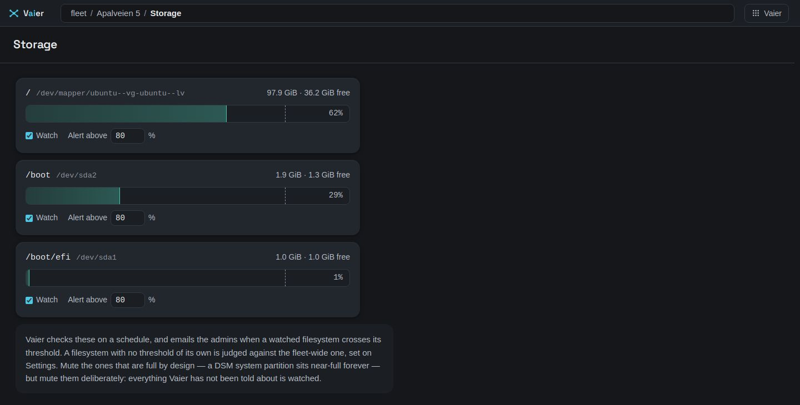

# Monitoring and alerts

Back to [README](../README.md).

What Vaier watches, when it mails you, and what you can do about it. Outside these cases it stays quiet.

---

## Email notifications

Admins are mailed (Settings → *Mail*) when:

- a server-type machine goes up or down
- a filesystem fills past its threshold
- a machine has [no default route](#a-machine-with-no-way-out)
- a container that was running [stops, turns unhealthy or restart-loops](#a-container-that-was-running-and-is-not)
- an image newly has an **update available**
- a first sign-in lands as a pending access request
- the [edge](NETWORKING.md#edge-hardening) blocks a **credential attack** or one of your **own networks**

Each alert is one mail when trouble starts and one when it ends. Vaier remembers what it has told you, so restarting or updating it never re-sends an alert you already had. When it cannot read something — a machine, CrowdSec, its own notes — it waits for the next round rather than guessing.

Without SMTP, monitoring is silent. A machine [switched off on purpose](EXPLORER.md#switched-off-on-purpose) sends no up/down or backup mail, and its nightly backup is skipped.

### Sending through Gmail

1. Turn on **2-Step Verification** for the Google account, at myaccount.google.com/security. Google offers app passwords only once it is on.
2. Create an **app password** at myaccount.google.com/apppasswords (name it "Vaier") and copy the 16 letters it shows. A Google Workspace admin may have switched app passwords off for the domain.
3. In Vaier, **Settings → Mail → Change**:

   | Field | Value |
   |---|---|
   | Host | `smtp.gmail.com` |
   | Port | `587` (Vaier uses STARTTLS; 465 will not work) |
   | Username | your full Gmail address |
   | Password | the app password, spaces or not — never your Google password |
   | Sender | the same Gmail address (Gmail replaces any other) |

4. Type your address as the test recipient and press **Send test email**. A failed test says why; `535` means the username or app password is wrong.

---

## Host disk monitoring

Every five minutes Vaier runs `df` over SSH on every machine it holds a **host credential** for, the Vaier host included (store a credential for it like any other machine). Every real filesystem is watched, not just `/`. An unreachable host is skipped, never mistaken for a full disk; one mount `df` cannot read, such as a stale network share, is skipped on its own and the rest are still watched.

- **The first sighting counts.** A filesystem already over its threshold is alerted on at once.
- **One mail per band.** Bands are 80, 85, 90, 95, 100. 86% → 89% is silence; 89% → 91% is a mail.
- **Recovery needs a margin** of five points below the threshold, so a disk wobbling around the line doesn't mail you daily.
- Mails carry size: *"[Vaier] NAS /volume1 is at 91% full (10.8 TiB, 1.0 TiB free)"*.

**Threshold** — default **85%**, under Settings → *Disk alerts*. From a machine's **disk** entry in the **Explorer**, give a filesystem its own threshold or **mute** it.

Each machine's card in the **Explorer** shows its worst watched filesystem: green, amber closing on its threshold, red over it. An unread machine shows **no mark at all**.

### Disk-fill forecast (early warning)

Vaier tracks each filesystem's fill rate and mails once when it is projected to reach **its own alert threshold** within **seven days** — *"projected to reach its 80% threshold in ~5 days"*. It needs three days of history first. Once the disk crosses its threshold the level alert takes over; the two never speak at once, and dipping back under the line doesn't warn again. An all-clear follows only if it drains or slows well clear of the horizon. Muted filesystems are never forecast.

---

## A machine with no way out

A machine that has lost its default route still serves local traffic and passes every other check, but cannot reach the internet — so a [container update](#update-available) there fails.

The five-minute rounds read each machine's **default-route standing**: **present**, **absent** (the fault), or **unknown**. **Unknown is not "no"**, and shows nothing.

When the route is absent, the machine's pane shows a "No default route" card under *What to do next*. It has no button: **Vaier can see this but cannot fix it**. You get one mail when the route goes and one when it comes back.

---

## A container that was running and is not

Vaier scrapes every machine's containers every 30 seconds. It speaks only about a container it has seen running well — containers stopped on purpose stay quiet. Stopped containers are listed reading **DOWN**.

Three kinds of trouble, worst first:

- **gone** — stopped or removed
- **restart-looping** — the only warning you get for a container that dies on start-up under `restart: always`
- **unhealthy** — up, but failing its own health check

Trouble must show on two consecutive scrapes, so an **Update** or a restart doesn't alert. A machine that didn't answer moves nothing.

**What you see.** The container list says **gone**, **unhealthy** or **restart-looping**, and the machine's pane gets a card under *What to do next* saying when it was last well. It has **no button**: Vaier cannot start or restart containers.

**What you're mailed.** One mail when trouble starts (*webtrees is unhealthy on Apalveien 5*), one when it is running well again; getting worse earns a new mail. A removed container earns one mail and is forgotten. If the machine rebooted after the container was last seen running, the mail says so. Times are in the server's own time zone.

---

## Update available

Once a day Vaier compares each container's image digest with what its registry serves for the **same tag**. Any Registry v2 host works, no account needed. **The sweep never pulls and never restarts anything.**

- **Vaier's own stack is not watched** — it updates with Vaier; see [Updating Vaier itself](#updating-vaier-itself).
- **One rollup mail** when images newly go out of date, naming image and machine (`vaultwarden/server:latest on Apalveien 5`).
- An image on a machine that was offline at sweep time, or in a stopped container, keeps what Vaier knew — it isn't mailed again when it's back.
- A **moving tag** (rebuilt daily, like `netdata/netdata:latest`) keeps its mark, labelled `moving`, but is never mailed.
- A registry Vaier can't read, a locally built image or a digest-pinned one reads **unknown** and shows no mark — so no mark is not a promise the image is current.

Out-of-date containers wear a small yellow mark in the **Explorer**. Only the Vaier server's and **server peers**' containers are covered; LAN servers read as unknown for now. **Check the registries now**, in a machine's container list, re-checks straight away.

### Update

An out-of-date container started by compose has an **Update** button. Vaier pulls the new image, recreates that container (briefly down), then removes the old image if nothing else uses it. If the recreate fails, the old container keeps running.

No button for a container started by hand, one in Vaier's own stack, or one on a machine where Vaier's SSH user isn't in the `docker` group — add it, and the button comes back.

### Updating Vaier itself

**Settings → Update Vaier** updates the whole of Vaier's own stack, compose file included, then runs `docker compose up -d`. If the stack doesn't come up, or Vaier doesn't answer within two minutes, it rolls back and Settings says so. The log is in `~/.vaier-upgrade/last-update.log` on the Vaier server.

It never touches your `.env` values or runtime folders (`vaier/config`, `wireguard/config`, `traefik/acme`, …), and it doesn't remove orphan containers. The first update onto this version is image-only.

---

## Vaier's own reverse proxy config

The **reverse proxy audit** reads back the Traefik config Vaier writes (`remote-apps.yml`) and reports entries that lead nowhere: unused or missing middlewares, redirect loops, routers with no service, and services nothing routes to.

**Vaier says so and does not touch the file.** It runs at startup and every five minutes. Findings show as one row in **Needs you** ("2 entries in the reverse proxy config lead nowhere"); **See which** lists them. You are mailed when a new finding appears and once when all are fixed; fixing some of them sends nothing. If Vaier can't read the file, it says nothing that round.

## Pre-flight

The one place that answers **"is this thing working?"** It checks the wildcard DNS record, the certificate (missing or under a fortnight left), WireGuard, and the server's own disk. Only a failing check appears, in **Needs you**, saying what is wrong and what to do. **A healthy check paints nothing.**

---

## What the edge blocks

Vaier shows what [CrowdSec](NETWORKING.md#edge-hardening) is blocking live in the Explorer's **Security** view, where you can lift a block or trust an address — see [`docs/EXPLORER.md`](EXPLORER.md#security).

**Almost none of it is emailed, on purpose.** Scanners hit every address all day; blocking them is CrowdSec working. Two things do reach you:

- **A credential attack** — brute force or password spraying aimed at *your* fleet. One rollup per sweep.
- **One of your own networks being blocked** — a ban inside your **trusted networks** means your own access is next. It gets its own lockout warning, in time to lift the block.

There is **no all-clear** when a block expires. If CrowdSec can't be read for a round, the view keeps its last list and nothing is mailed.
