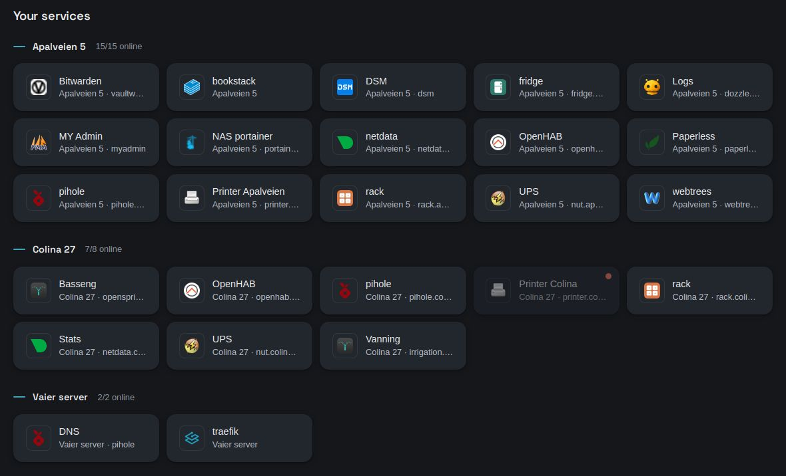
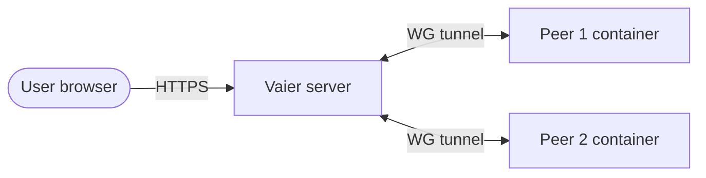

# Networking: VPN, reverse proxy, DNS, publishing

Back to [README](../README.md).



---

## How it fits together



Every published service resolves to the Vaier server through your one `*.yourdomain.com` record. Traefik terminates TLS, optionally asks for social login, and proxies the request over WireGuard to the container on a peer.

---

## Adding a VPN peer

In the **Explorer**, choose **Add a machine**. It asks what you are adding and generates the rest (address, keys, config):

- **A server or PC that should join** — give it a **name**, then run the one-line setup shown in the **handoff**.
- **A phone or computer I carry** — an Android phone or Windows PC joins through the **Vaier app**. See [Enrolment from the Vaier app](#enrolment-from-the-vaier-app).
- **Something already on one of my networks** — see [LAN servers](#lan-servers-and-the-lan-scanner).

| What | Default routing | Handoff |
|------|-----------------|---------|
| A server | VPN subnet only | A **no-sudo setup link**: paste one `curl -fsSL '…/vpn/peers/<id>/setup?t=<token>' \| bash` line. It runs WireGuard in a container (Docker only, no root). The link is single-use and short-lived |
| An Android phone or Windows PC | All traffic | The Vaier app and a join code — Vaier makes no config |

The handoff turns green on the first handshake. Set a server's routed LAN later from its pane; Vaier reads the network and asks only whether the fleet should reach it.

Things worth knowing:

- **A full-tunnel client can't reach the LAN it is sitting on.** Its kill-switch drops that traffic. At home you don't need the tunnel for it; away, the same address works through the tunnel.
- **Setup scripts refuse to run on the wrong machine** — for example a Vaier server, or a host that would lose its own uplink. A machine is a peer *or* a LAN server, never both. Re-run with `VAIER_FORCE=1` if you truly mean it.
- **A relay set up before 23 September 2026 needs its setup link re-run** to survive Docker daemon restarts and carry long replies from tiny devices.

### Site-to-site routing

With two or more relay peers, a machine on one site's LAN can reach a machine on another's, through both relays and the Vaier server. The far host sees the relay as the sender and needs no configuration. A LAN host that should *start* such connections needs the [LAN setup script](#lan-servers-and-the-lan-scanner).

**Adding, removing or re-addressing a relay makes every other server peer's config out of date.** On each relay, **Reissue** and run the setup link again. The keypair is kept.

### Names, descriptions and status

- **Edit details** sets a machine's name and **description**. Renaming breaks nothing, and names **do not have to be unique**.
- An amber icon means reachable but the Docker scrape failed; red means unreachable.
- **Removing a machine** also forgets its SSH login and host key and stops its backups. The archives already made stay on the backup server.
- The **Map** shows one marker per site. Phones and laptops are never placed on it.

### Show-once peer config

A server peer's config is shown **exactly once**, at creation. Save what you need before closing the modal. For a fresh one, the pane offers under **Keys and removal**:

- **Send its setup again** (Reissue) — keeps the keypair. Use it for a lost config or an ⚠ **out-of-date config** badge.
- **Give it new keys** (Regenerate) — rotates the keypair; the old config stops working at once. The machine keeps its address, published services, login and backups.

### Enrolment from the Vaier app

This is the only way a phone or a Windows PC joins.

1. On the device, open **Your services** and use the **Install card** — no store, no account. The app already knows your Vaier's address.
2. In the app, ask to join. It shows a four-digit **join code**.
3. Approve it under **Waiting to join** on the fleet page, or from the mail admins receive.

At most five devices wait at once, and at most two from one internet address. A request waits ten minutes. The mail goes out at most once every ten minutes, so check **Waiting to join** for the rest.

The private key never leaves the device, so there is nothing to save.

- **Android:** add the **Vaier** tile to Quick Settings to connect without opening the app.
- **Windows:** run `VaierSetup.exe` and choose **Install**. The tunnel keeps running with the window closed. If the window says **Vaier is not running**, use **Repair**. The app is not yet signed, so SmartScreen warns on first run.
- **Leave Vaier** removes the device from the fleet. A device you remove from your end notices on its own within a few minutes.
- To remove a device, don't do it from a browser on that device — that cuts the tunnel carrying Vaier's answer. Use **Leave Vaier** instead.

### Fleet DNS

Personal devices use Vaier's **Pi-hole** for DNS, reachable only through the tunnel. Its own password is off, so publish its admin page only behind social login, never as public; only admins can open it. Through the tunnel a device reaches only that DNS and Vaier's published addresses — never the containers of Vaier's own stack directly.

---

## LAN servers and the LAN scanner

**LAN servers** — a NAS, printer, IPMI host, or extra Docker host on a peer's LAN — need only a LAN address.

1. In **Add a machine**, pick *Something already on one of my networks*.
2. Pick **where it is** (**At <name>**) and Vaier scans that LAN.
3. Pick a host and type a name. If it speaks SSH, attach and **test** a credential.

If the scan finds nothing, use **Add by address instead**.

Then run the host's single-use **setup link** with `sudo`. It opens the Docker API to the fleet only and adds routes to the rest of your network. It is safe to re-run.

For LAN servers reached from non-peer machines, see [`docs/ADVANCED.md`](ADVANCED.md).

---

## Publishing a service

1. Start a Docker container on any connected peer.
2. In the **Explorer**, open the peer's pane; the container shows as a **+ Publish** row.
3. Click it, enter a subdomain, and optionally require Social login.
4. Vaier writes the route and waits for Traefik to accept it. There is no DNS step.

The service is live at `https://subdomain.yourdomain.com`. If Traefik refuses the route, or never loads it, Vaier removes it again.

A name too close to an existing one is refused: `printer-colina27` beside `printer.colina27`, or `/a-b` beside `/a/b` on one subdomain. Pick another.

- Open a published service under its machine to edit it or **Unpublish** it. The container keeps running.
- **Ignore** hides a **+ Publish** row.
- A LAN server behind a relay has a **Publish LAN port** form.
- On the Vaier server, only **Traefik's dashboard** and **Pi-hole's admin** are offered from Vaier's own stack. Publish them behind social login: like the console, only admins can open them, and only admins see their tiles.

For auth modes and who can reach a service, see [`docs/AUTH.md`](AUTH.md).

### Multiple services on one subdomain

Set a **Path prefix** (e.g. `/auth`) to share one subdomain. The full path reaches the backend unchanged:

```
bmp.yourdomain.com         →  http://rig.yourdomain.com:8080
bmp.yourdomain.com/auth/*  →  http://rig.yourdomain.com:8090/auth/*
```

### Publishing a port that is not a website

Choose **raw TCP** instead of **website** to publish a **stream**: clients connect over TLS to e.g. `mqtt.example.com:443`. The port you enter is the backend port.

**A stream cannot be put behind a login, and CrowdSec does not watch it.** Publish one only for a service whose own password you trust. If the client can't speak TLS, reach the service over the VPN at its LAN address instead.

---

## Your services

A public page that links to your published services, switching to LAN URLs when you're on the same network. Strangers see only public services. Signed-in users also see the social-login services they may reach; admins see all.

You can hide internal-only services. A red dot means the host is confirmed unreachable.

---

## Reverse proxy

Each service has an **auth mode** (public or **Social login**). When a backend is down, visitors see Vaier's **offline page**.

## Edge hardening

Traefik adds a baseline to every response:

- `nosniff` and `strict-origin-when-cross-origin` **security headers** on every service; a **frame guard** on Vaier's own pages only.
- An **edge TLS policy**: TLS 1.2 minimum, forward-secret ciphers only.

**CrowdSec** blocks known-malicious traffic, including addresses from its **community blocklist**, on every **published service**. Your **trusted networks** are never blocked. A first ban lasts four hours; repeat bans run longer.

The Explorer's **Security** view lists every blocked address. Each row's **…** menu offers **Lift the block** and **Trust this address**. **Block an address** bans one by hand for up to 7 days.

**Caveat:** trusting lifts the block at once, but the allowlist entry — and any **Untrust** — only takes effect when CrowdSec next restarts. Vaier won't restart it for you.

**If CrowdSec bans your own address**, sign in through the [recovery doors](#the-recovery-doors) and lift the block in the Security view. Your published services refuse you until you do. From the host, `docker exec crowdsec cscli decisions delete --all` clears every block.

---

### The recovery doors

`vaier.<domain>`, `oauth2.<domain>` and `dex.<domain>` are the **recovery doors**: a CrowdSec ban does not apply to them, so it can't lock you out of the console that lifts it. They still require sign-in and admin approval.

## Wildcard DNS

DNS is one record you make once, at your DNS host:

```
*.yourdomain.com  A  <your server's public IP>
```

That covers the console, sign-in and every service you publish. Vaier needs no DNS credentials. At boot Vaier checks the record; anything but **covered** shows as a **pre-flight** finding under **Needs you** on the Fleet.

> **One caveat worth knowing.** Vaier publishes machine-qualified names two labels deep — `openhab.colina27.yourdomain.com`. If your zone gains a real record *under a machine label* (say an `A` record for `colina27.yourdomain.com`), `*.yourdomain.com` stops covering everything beneath `colina27` and that machine's services go dark. Keep the zone free of records under a machine label, or add a `*.colina27.yourdomain.com` wildcard alongside it.

Certificates are still issued one per hostname; the record is not a wildcard certificate.
